# Module 5 Challenge: Password Generator

## Overview

This web app was created for the purpose of gaining experience writing advanced JavaScript. The application alows the user
to generate a random password based on the following criteria:

- [The number of characters required for the password]
- [If the user wants to include numeric characters]
- [If the user wants to include lower case characters]
- [If the user wants to include upper case characters]
- [If the user wants to include special characters]

The app also validates the user input by ensuring that:

- [The user enters a number between 10 and 64 inclusive]
- [The user choosed at least one character type]

The application uses the following prompts to guide the user through the process of generating a secure password:

## Initial screen Screen

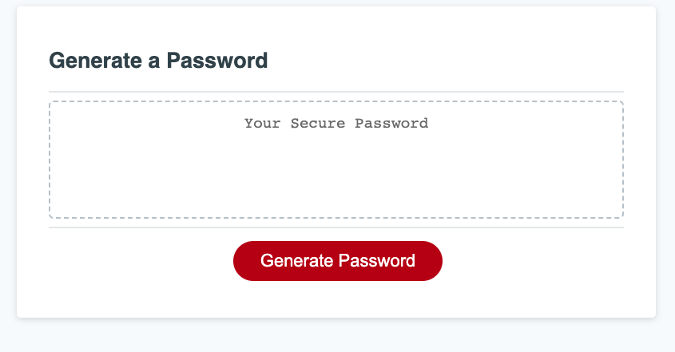

## Number of characters option screen

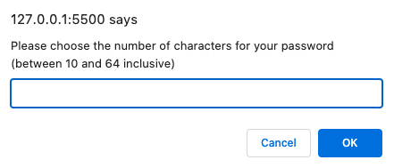

## Use Numerical characters option screen

## Use Uppercase characters option screen

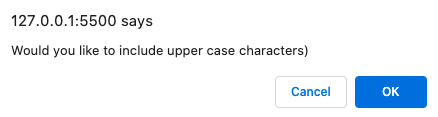

## Use Lowercase characters option screen

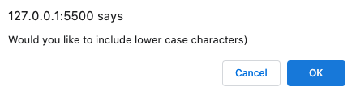

## Use Special characters option screen

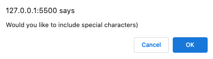

## Display password screen

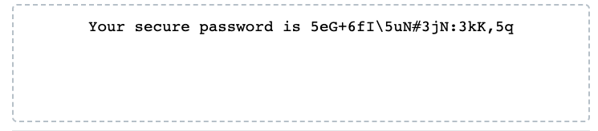

## Validation Errors: Empty value for number of characters screen

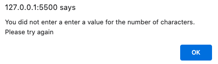

## Validation Errors: Invalid data type

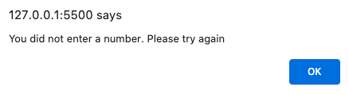

## Validation Errors: Number of characters too short

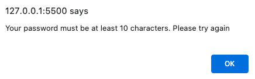

## Validation Errors: Number of characters too long

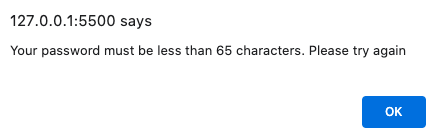

## Validation Errors: No character type chosen

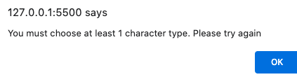

## Deployment

The application wa deployed to GitHub Pages using the following process:

- [Pushing the refactored files to a remote repository]
- [From the repository, select the Settings tab on the right side of the page]
- [In the section labeled Source, select the `main` branch as your source]
- [Click 'save']
- [The app is now available on GitHub Pages (see 'usage' below for access details)]

## Usage

To view the app visit:

https://welsh-bloke.github.io/password-generator/

## License

Please refer to the LICENSE in the repo.
